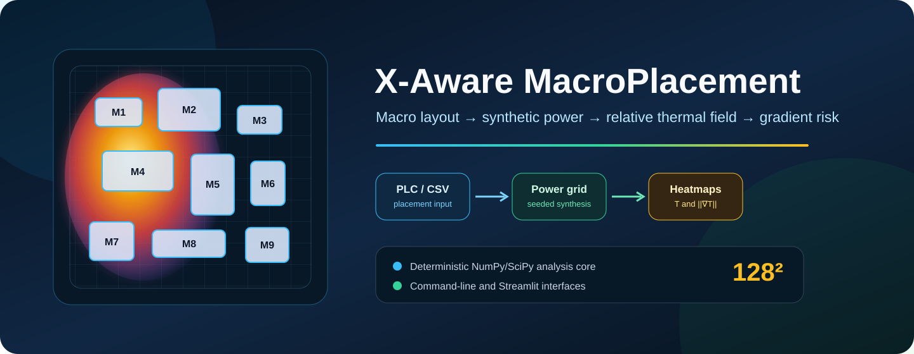
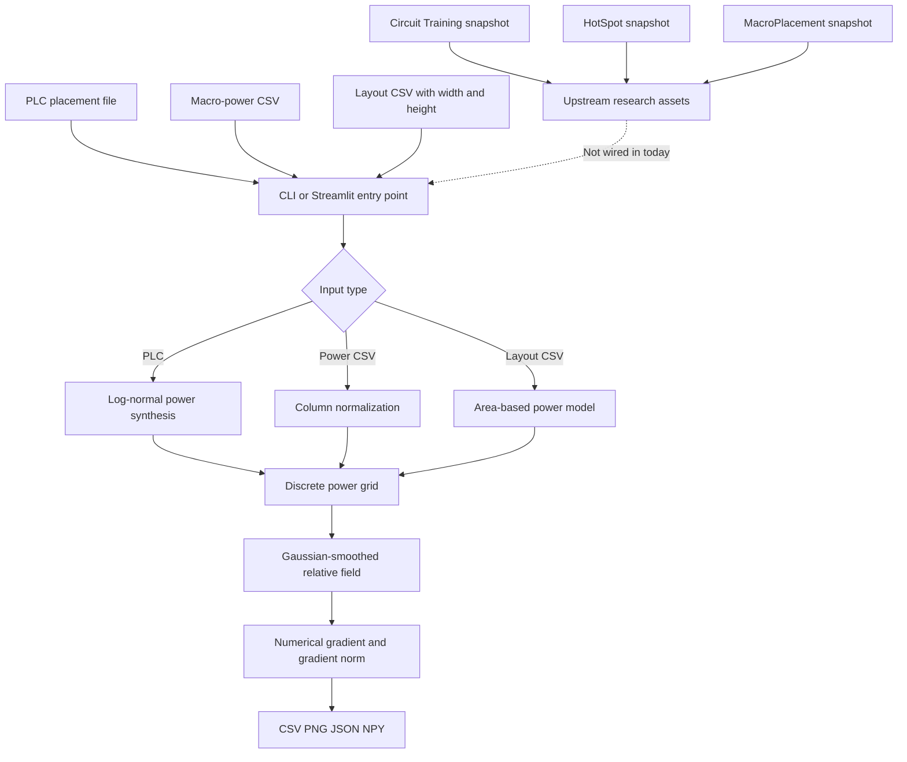
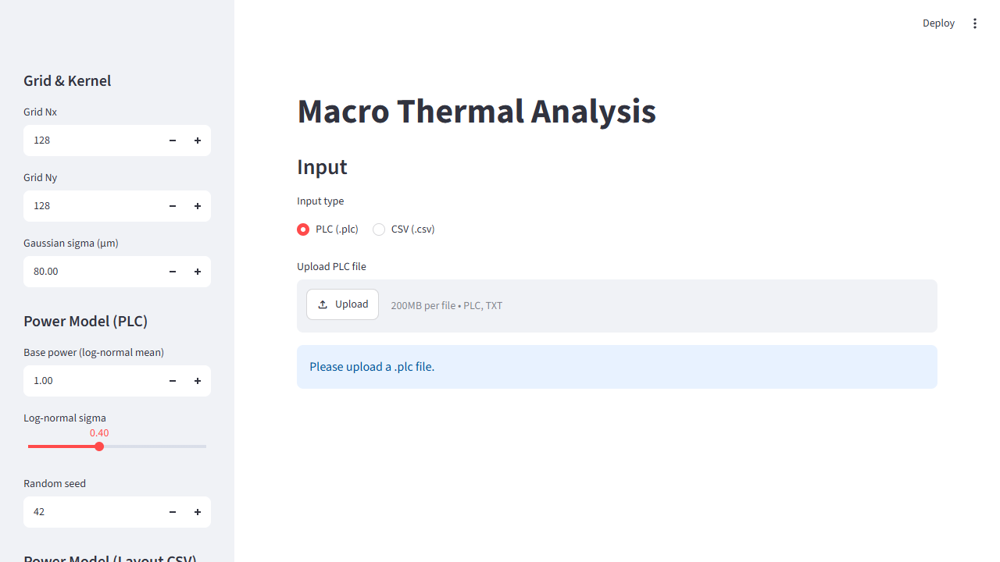
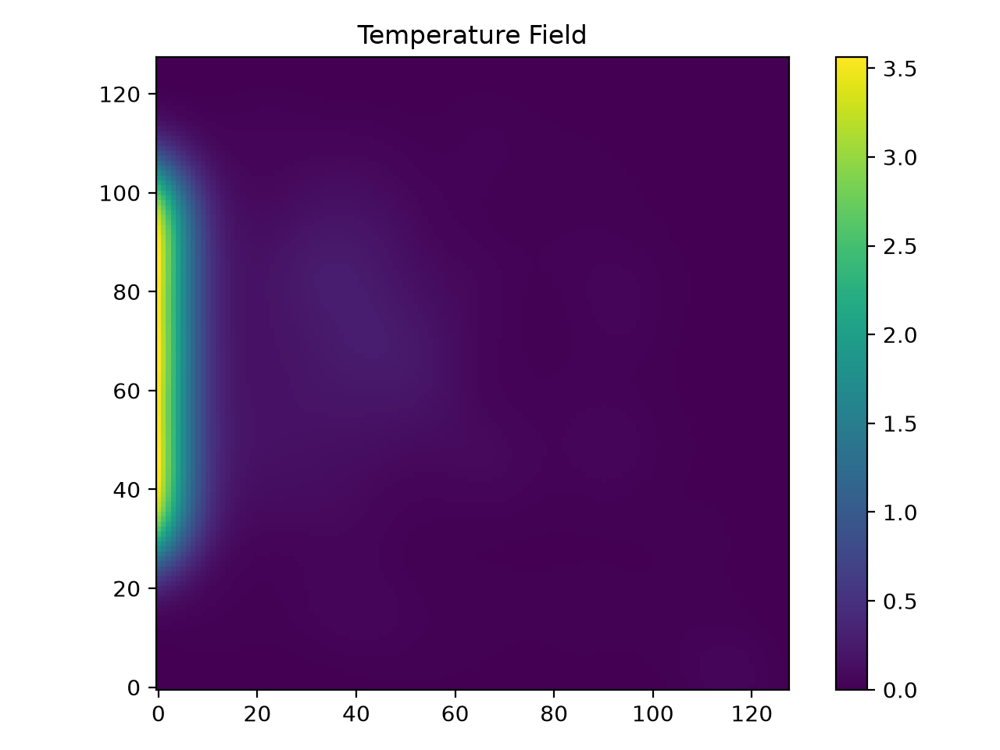
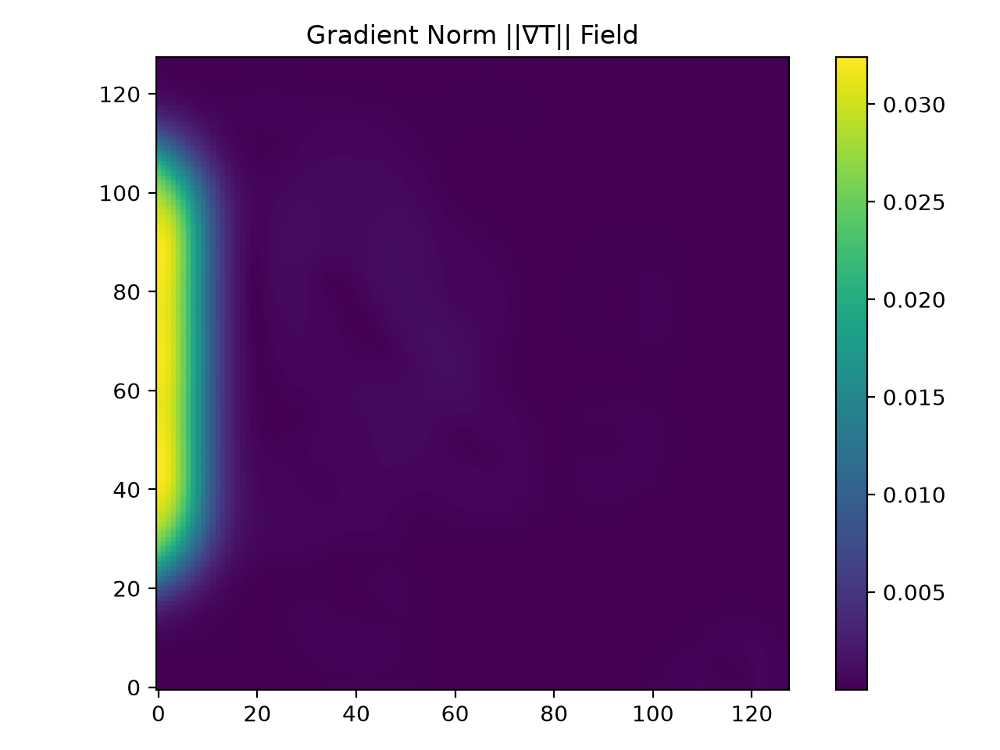
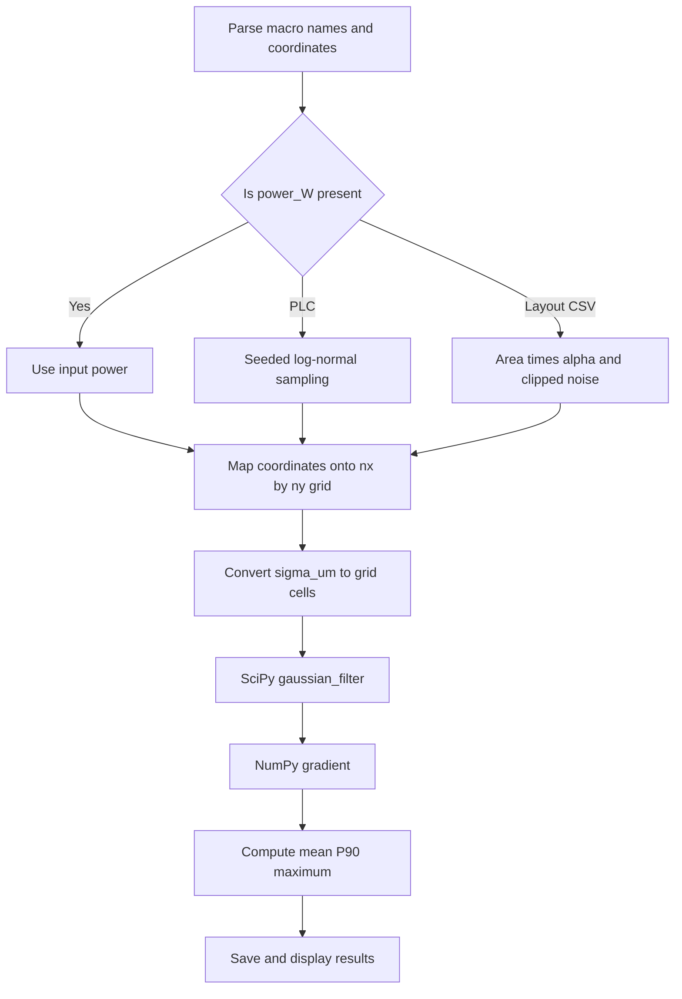

<p align="center">
  
</p>

<p align="center">Figure 1. From macro placement to relative thermal and gradient-risk fields</p>

<div align="center">
  <h1>X-Aware MacroPlacement</h1>
  <p><strong>A research prototype for macro-power synthesis, approximate thermal-field analysis, and gradient-risk visualization</strong></p>
  <p>
    <a href="README.md">简体中文</a> ·
    <a href="#quickstart-en">Quick start</a> ·
    <a href="#method-en">Method</a> ·
    <a href="#validation-en">Validation</a> ·
    <a href="#limitations-en">Limitations</a>
  </p>
</div>

<p align="center">
  
  
  
  
  
  
  
  
</p>

> [!IMPORTANT]
> The current thermal field is a relative research signal produced by Gaussian smoothing over a discrete power grid. It is not a temperature in degrees Celsius and cannot replace HotSpot, finite-element analysis, or signoff-grade thermal simulation.
>
> The repository vendors snapshots of Circuit Training, HotSpot, and MacroPlacement. Each snapshot retains its own license and technical boundary, and the root Python prototype does not automatically invoke any of them.

> [!WARNING]
> The former README named December 20, 2025 as a delayed expected release date. The repository currently has no version tag, GitHub Release, continuous-integration workflow, or other evidence of a formal release.
>
> As of August 24, 2026, treat this repository as an in-progress research prototype for reproducing experiments, reviewing the algorithm, and continuing development. Do not use it directly as a production EDA signoff tool.

Repository size, output values, dependency versions, and run results below come from an audit of commit `5ae674c6d3d73cf65d86b5d9590ed2ac99f80f00` and isolated validation performed on August 24, 2026.

<a id="overview-en"></a>
## 1 Project overview

X-Aware MacroPlacement explores an inspectable path from placement coordinates through synthesized power to a relative thermal field and its spatial gradient. Three first-party Python files provide a command-line batch interface and a Streamlit GUI. The repository also retains full upstream materials from Circuit Training [1], HotSpot [2], and MacroPlacement [3] for reinforcement-learning placement, physical thermal simulation, and public benchmark research.

<div align="center">

Table 1.1 Current capabilities

| Area | Current implementation | Evidence |
| --- | --- | --- |
| Placement input | Reads Circuit Training-style `.plc` text | `scripts/thermal_cli.py`, `scripts/thermal_gui.py` |
| Power input | Reads `name,x_um,y_um,power_W` or the equivalent macro-name form | `detect_csv_type` in both interfaces |
| Layout input | Reads a layout CSV with width and height, then synthesizes power from area | `layout_csv_to_macro_power` |
| Power synthesis | Uses seeded log-normal power for PLC and an area model for layout CSV | `simulate_power_lognormal`, `layout_csv_to_macro_power` |
| Thermal approximation | Maps point power to a grid and applies SciPy Gaussian smoothing [4] | `src/thermal/thermal_model.py` |
| Risk metrics | Reports mean, 90th percentile, and maximum for the field and gradient norm | `thermal_metrics` |
| CLI outputs | Writes macro-power CSV, heatmap PNG, metrics JSON, and optional NPY | `scripts/thermal_cli.py` |
| GUI | Uploads PLC or CSV and exposes grid, kernel, and power-model controls | `scripts/thermal_gui.py` |
| Example assets | Stores 1,410 parsed records, four NPY arrays, and three metrics files | `scripts/legalized.plc`, `data/`, `outputs/` |
| Language | Chinese-first README with a complete English backup | `README.md`, `README.en.md` |

</div>

The prototype answers where relative hotspots and steep field changes may appear under its approximation. It does not train an RL policy, legalize a placement, invoke HotSpot, model physical package boundaries, or issue a signoff conclusion.

<a id="positioning-en"></a>
## 2 Fit and project status

<div align="center">

Table 2.1 Fit assessment

| Scenario | Fit | Basis |
| --- | --- | --- |
| Inspecting the PLC-to-heatmap data path | Good | Inputs, scripts, arrays, JSON, and figures are present |
| Studying grid-size and Gaussian-kernel effects | Good | Both interfaces expose `nx`, `ny`, and `sigma_um` |
| Prototyping a macro-placement reward feature | Conditional | The output can be a relative feature after calibration and provenance checks |
| Comparing physical temperatures across placements | Not ready | Thermal resistance, materials, boundary conditions, and absolute units are absent |
| Chip thermal or reliability signoff | Unsuitable | The implementation is not a signoff solver and has no validated error bound |
| Training Circuit Training directly | Unsuitable | The root prototype is not connected to the vendored training workflow |

</div>

<div align="center">

Table 2.2 Status evidence

| Status item | Current evidence | Conclusion |
| --- | --- | --- |
| Former target date | The old README listed December 20, 2025 and marked it delayed | The date has passed and is retained only as history |
| Version tags | None | No citable version exists |
| GitHub Releases | None | No release package exists |
| Dependency manifest | No `requirements.txt`, `pyproject.toml`, or lock file | Users must manage dependency versions |
| Automated tests | No test directory or CI workflow | This audit is independent validation, not built-in assurance |
| Project stage | Core scripts, sample data, and GUI run | In-progress research prototype |

</div>

<a id="architecture-en"></a>
## 3 Architecture

<div align="center">



Figure 3.1 Boundary between the root prototype and vendored upstream projects

</div>

`scripts/thermal_cli.py` and `scripts/thermal_gui.py` each contain their own parsing and power-synthesis helpers. Both call `src/thermal/thermal_model.py`, but the duplicated helpers have not been extracted into a shared module, so behavior may drift over time.

<a id="gallery-en"></a>
## 4 Interface and output gallery

<p align="center">
  
</p>

<p align="center">Figure 4.1 Streamlit input interface rendered in an isolated local environment</p>

The GUI switches between PLC and CSV, exposes grid dimensions from 16 to 512, a Gaussian sigma from 1 to 500 micrometers, a random seed, and parameters for both power models. A PLC can be converted to a downloadable macro-power CSV or analyzed directly.

<p align="center">
  
</p>

<p align="center">Figure 4.2 Relative field replayed from `scripts/legalized.plc` with current defaults</p>

<p align="center">
  
</p>

<p align="center">Figure 4.3 Gradient-norm field from the same replay</p>

Figures 4.2 and 4.3 contain relative values. A bright area means the current model concentrates more power there; it is not by itself a physical temperature or failure location.

<a id="method-en"></a>
## 5 Analysis method

<div align="center">



Figure 5.1 Relative-field and gradient-metric computation

</div>

### 5.1 PLC power model

The PLC parser treats every non-empty, non-comment record whose first three columns parse successfully as a macro. Power comes from a mean-normalized log-normal sample. Defaults are `1.0` base power, `0.4` log sigma, and random seed `42`. Identical inputs and parameters produce an identical power table.

### 5.2 Layout CSV power model

When a CSV provides `width_um` and `height_um`, the script multiplies rectangular area by the default `1e-5 W/µm²` coefficient. Gaussian noise defaults to standard deviation `0.2` and is clipped to `[-0.5, 0.5]`.

### 5.3 Relative field and gradient

The core accumulates point power in the nearest grid cells and spreads it with SciPy `gaussian_filter` [4]. Grid spacing comes from chip width and height, while NumPy `gradient` provides spatial derivatives [5]. The output key remains named `temperature`, but the code does not solve the heat equation. “Gaussian-smoothed relative power field” is the more precise interpretation.

<a id="inputs-en"></a>
## 6 Input and output contract

<div align="center">

Table 6.1 Inputs

| Input | Required columns or record | Power source | Default chip size |
| --- | --- | --- | --- |
| PLC | Each valid record begins with `name x y` | Log-normal synthesis | Maximum x and y multiplied by `1.1` |
| Macro-power CSV | `name` or `macro_name`, `x_um`, `y_um`, `power_W` | Direct input | Maximum x and y multiplied by `1.1` |
| Layout CSV | `macro_name`, `x_um`, `y_um`, `width_um`, `height_um` | Area model | Maximum x and y multiplied by `1.1` |

</div>

<div align="center">

Table 6.2 CLI outputs

| Directory | File | Content |
| --- | --- | --- |
| `<out-dir>/macro_power/` | `<prefix>_macro_power.csv` | Normalized names, coordinates, and power |
| `<out-dir>/figures/` | `<prefix>_temperature.png` | Relative-field heatmap |
| `<out-dir>/figures/` | `<prefix>_grad_norm.png` | Gradient-norm heatmap |
| `<out-dir>/metrics/` | `<prefix>_thermal_stats.json` | Mean, 90th percentile, and maximum for both fields |
| `data/thermal/` | `<prefix>_temp.npy`, `<prefix>_grad_norm.npy` | Arrays written when `--save-npy` is used |

</div>

Note: `--save-npy` currently writes to root-level `data/thermal/` and does not follow `--out-dir`.

<a id="quickstart-en"></a>
## 7 Quick start

### 7.1 Prepare an environment

The August 24, 2026 audit validated Python 3.12.7 with NumPy 2.5.2, pandas 3.0.5, SciPy 1.18.1, Matplotlib 3.11.1, and Streamlit 1.62.0 on Windows. These are a reproducible audit baseline, not a compatibility range promised by the project.

Step one, create an isolated environment and install the validated dependencies.

```powershell
python -m venv .venv # Create a Python virtual environment dedicated to this project
.\.venv\Scripts\Activate.ps1 # Activate the virtual environment in the current PowerShell session
python -m pip install numpy==2.5.2 pandas==3.0.5 scipy==1.18.1 matplotlib==3.11.1 streamlit==1.62.0 # Install the dependency combination validated on August 24, 2026
```

Step two, enable Python UTF-8 mode on a Windows console and replay the example.

```powershell
$env:PYTHONUTF8 = "1" # Prevent the default console encoding from rejecting the micrometer symbol
python scripts\thermal_cli.py --plc-file scripts\legalized.plc --out-dir outputs\replay --prefix legalized # Replay the PLC example with current defaults
```

Step three, inspect the power table, heatmaps, and metrics JSON under `outputs/replay/`.

Use this equivalent path on Linux or macOS.

```bash
python3 -m venv .venv # Create a Python virtual environment dedicated to this project
source .venv/bin/activate # Activate the virtual environment in the current shell
python -m pip install numpy==2.5.2 pandas==3.0.5 scipy==1.18.1 matplotlib==3.11.1 streamlit==1.62.0 # Install the dependency combination validated on August 24, 2026
python scripts/thermal_cli.py --plc-file scripts/legalized.plc --out-dir outputs/replay --prefix legalized # Replay the repository example with default parameters
```

### 7.2 Launch the GUI

```powershell
$env:PYTHONUTF8 = "1" # Enable Python UTF-8 mode on a Windows console
python -m streamlit run scripts\thermal_gui.py --server.address 127.0.0.1 # Bind the Streamlit development interface to the local machine only
```

Streamlit provides the interface [6]. A remote deployment needs authentication, transport encryption, and firewall controls. Do not expose the development server directly to the public internet.

<a id="cli-en"></a>
## 8 Command-line reference

<div align="center">

Table 8.1 Main options

| Option | Default | Description |
| --- | --- | --- |
| `--plc-file` | Exclusive with `--macro-csv` | PLC placement file |
| `--macro-csv` | Exclusive with `--plc-file` | Macro-power or layout CSV |
| `--out-dir` | `outputs` | Output root for CSV, PNG, and JSON |
| `--prefix` | Input filename | Output filename prefix |
| `--chip-width-um` | Maximum x multiplied by `1.1` | Manual chip-width override |
| `--chip-height-um` | Maximum y multiplied by `1.1` | Manual chip-height override |
| `--nx`, `--ny` | `128` | Grid columns and rows |
| `--sigma-um` | `80.0` | Physical scale of the Gaussian kernel |
| `--save-npy` | Off | Save NumPy arrays |
| `--base-power` | `1.0` | Mean synthesized power for PLC |
| `--log-sigma` | `0.4` | Log-normal spread for PLC |
| `--seed` | `42` | Random seed for both synthesis models |
| `--alpha-w-per-um2` | `1e-5` | Area-to-power coefficient |
| `--noise-std` | `0.2` | Noise standard deviation for area power |

</div>

<a id="validation-en"></a>
## 9 Data assets and validation

The comments in `scripts/legalized.plc` describe Ariane, NanGate45, and macro-placement cost metadata. The lightweight parser does not distinguish hard macros, pins, or other node types from this metadata; it reads 1,410 coordinate records.

<div align="center">

Table 9.1 Default replay results

| Metric | Relative field | Gradient norm |
| --- | ---: | ---: |
| Mean | 0.1499493718 | 0.0016559281 |
| 90th percentile | 0.2410360724 | 0.0013460991 |
| Maximum | 3.5641796589 | 0.0324288234 |

</div>

<div align="center">

Table 9.2 Validation record

| Check | Environment or input | Result |
| --- | --- | --- |
| Python syntax | Three first-party Python files | Passed |
| Core smoke test | Two synthetic macros on a 32 × 32 grid | Correct shapes, finite values, deterministic result |
| PLC replay | `scripts/legalized.plc` with defaults | 1,410 records; generated power CSV exactly matches the committed CSV |
| Metrics replay | Current code versus `legalized_thermal_stats.json` | Mean and maximum match; P90 differs only at floating percentile precision |
| CLI figures | Relative-field and gradient-norm PNG | Generated and visually inspected |
| Streamlit | Chromium in an isolated local instance | Title, input mode, parameters, and upload control rendered correctly |
| Windows default encoding | `PYTHONUTF8` unset | Micrometer output raises `UnicodeEncodeError` |
| Built-in tests and CI | Repository scan | Not provided |

</div>

### 9.1 Provenance difference in committed outputs

The PLC replay produces a macro-power CSV that exactly matches `outputs/macro_power/legalized_macro_power.csv`. Running the current code on that CSV again produces a relative-field maximum of `3.5641796589`. The committed `legalized_macro_power_temp.npy` and its JSON instead contain a maximum of `171.9764862061`, approximately 48.25 times the current replay value.

The repository does not retain a different input, parameter set, or execution log that explains the larger historical output. Preserve it as an asset awaiting provenance, but do not compare it directly with the current default replay or describe it as reproduced.

<a id="structure-en"></a>
## 10 Repository structure

<div align="center">

Table 10.1 Directory responsibilities

| Path | Content | Maintenance boundary |
| --- | --- | --- |
| `src/thermal/thermal_model.py` | Power grid, relative field, gradient, and metrics | Root prototype core |
| `scripts/thermal_cli.py` | CLI parsing, power synthesis, and output persistence | Root prototype interface |
| `scripts/thermal_gui.py` | Streamlit upload, controls, and result display | Root prototype interface |
| `scripts/legalized.plc` | Sample placement and public design metadata | One local absolute path was redacted during this audit |
| `data/thermal/` | Committed relative-field and gradient arrays | Some provenance remains missing |
| `outputs/macro_power/` | Committed normalized macro-power CSV | Reproducible from the default PLC replay |
| `outputs/metrics/` | Committed metrics JSON | Reproducibility differs across the result sets |
| `docs/assets/readme/` | Banner, GUI capture, and replay heatmaps | Local README visual assets |
| `external/circuit_training/` | Google Circuit Training snapshot | Upstream Apache 2.0 project |
| `external/HotSpot/` | HotSpot simulator snapshot | Upstream custom open-source license |
| `external/MacroPlacement/` | TILOS MacroPlacement snapshot and benchmarks | Upstream BSD 3-Clause project plus nested licenses |

</div>

The repository tracks 3,824 files, 3,808 of which are under `external/`. Clone size, third-party licenses, binary artifacts, and upstream-update policy are therefore material parts of project governance.

<a id="upstream-en"></a>
## 11 Upstream projects and licenses

<div align="center">

Table 11.1 Vendored upstream projects

| Project | Purpose | Root license | Current integration |
| --- | --- | --- | --- |
| Circuit Training [1] | Distributed deep-RL framework for chip floorplanning | Apache 2.0 | Full snapshot retained; not called by the root prototype |
| HotSpot [2] | Early-stage thermal simulation for 2D, 3D, and microfluidic-cooled ICs | Upstream `LICENSE` | Full snapshot retained; not called by the root prototype |
| MacroPlacement [3] | Macro-placement benchmarks, flows, translators, and public reproduction studies | BSD 3-Clause | Full snapshot retained; not called by the root prototype |

</div>

Root-level code is released under Apache License 2.0 [7]. Files under `external/` remain governed by their own licenses, and MacroPlacement test cases include additional nested license files. Review the complete license tree before redistributing, modifying, or packaging the entire repository.

<a id="security-en"></a>
## 12 Privacy, security, and deployment boundary

The first-party scan found no account, password, token, or license-key material. A comment in the sample PLC contained an identifiable absolute server path; it has been replaced by a redacted provenance marker while preserving the fact that the file has a source. Two commented HotSpot Makefile examples also contained a historical user directory and a version path that resembled a private network address; generic MKL installation placeholders now replace them.

The repository publishes no hosted service URL and asks for no credentials. Uploaded Streamlit content is processed by the environment running the process, so use a controlled local machine or protected internal network. A public deployment would require authentication, HTTPS, upload limits, resource isolation, redacted logs, and dependency-vulnerability review.

Vendored projects can contain paper-author names, maintainer email addresses, public benchmark paths, and upstream history. These are public third-party attribution and provenance records; do not bulk-delete them or present them as first-party content without a license review.

<a id="limitations-en"></a>
## 13 Known limitations and roadmap

<div align="center">

Table 13.1 Known limitations

| Limitation | Current impact | Recommended direction |
| --- | --- | --- |
| Relative field has no physical temperature unit | Cannot support thermal signoff or absolute cross-platform comparison | Integrate HotSpot or a calibrated thermal-resistance model |
| PLC parser only reads the first three columns | 1,410 parsed records are not equivalent to the 133 hard macros in comments | Filter by node type and PLC metadata |
| Committed outputs lack complete run provenance | One historical array set cannot be reproduced with current defaults | Store input hashes, parameters, and commit IDs for every run |
| Helper functions are duplicated across interfaces | CLI and GUI may drift | Extract a shared input and power module |
| No dependency manifest | Global NumPy and pandas versions can become binary-incompatible | Add `pyproject.toml` and a lock file |
| Windows default encoding stops the CLI | A run fails unless UTF-8 mode is enabled | Use ASCII unit text or configure stdout explicitly |
| `--save-npy` ignores `--out-dir` | A run may overwrite the repository data directory | Place NPY output under the selected output root |
| No invalid-input boundary tests | Null, negative-power, and out-of-range coordinate behavior is unverified | Add unit, property, and end-to-end tests |
| No CI | Compatibility regressions are not discovered automatically | Test each supported Python version and rendered GUI |
| Three upstream snapshots are large | Cloning, auditing, and updates are expensive | Record exact upstream commits and assess submodules or release assets |

</div>

Recommended sequence:

1. First, pin dependencies and supported Python versions, then turn the current smoke check into a repository test.

2. Second, record input hashes, every parameter, dependency versions, and the code commit for each output, then regenerate the untraceable historical arrays.

3. Third, unify CLI and GUI parsing and power logic, then fix Windows encoding and the NPY output directory.

4. Fourth, compare the approximate field with HotSpot and publish units, calibration error, and applicability conditions.

5. Fifth, integrate a calibrated thermal feature into Circuit Training or MacroPlacement rewards, constraints, and evaluation.

<a id="contributing-en"></a>
## 14 Contributing and reproduction requirements

An algorithm or data change should include a minimal input, complete parameters, random seed, dependency versions, code commit, output summary, and error judgment. Prefer repository-local images over remote screenshots that may expire or reveal an environment. Never place real server addresses, user directories, accounts, tokens, license keys, or unauthorized proprietary designs in examples.

Before merging, run syntax checks, core unit tests, end-to-end tests for PLC and both CSV forms, CLI output checks, Streamlit render checks, and a privacy scan.

<a id="license-en"></a>
## 15 License

The root project uses Apache License 2.0. See [`LICENSE`](LICENSE) for the full terms. Third-party directories retain their own licenses; users must separately follow `external/circuit_training/LICENSE`, `external/HotSpot/LICENSE`, `external/MacroPlacement/LICENSE`, and deeper nested license files.

<a id="references-en"></a>
## 16 References

[1] Google Research, “Circuit Training: An open-source framework for generating chip floor plans with distributed deep reinforcement learning,” GitHub. [Online]. Available: https://github.com/google-research/circuit_training

[2] University of Virginia, “HotSpot: A pre-RTL processor thermal simulator,” GitHub. [Online]. Available: https://github.com/uvahotspot/HotSpot

[3] TILOS AI Institute, “MacroPlacement,” GitHub. [Online]. Available: https://github.com/TILOS-AI-Institute/MacroPlacement

[4] SciPy Community, “scipy.ndimage.gaussian_filter,” SciPy documentation. [Online]. Available: https://docs.scipy.org/doc/scipy/reference/generated/scipy.ndimage.gaussian_filter.html

[5] NumPy Developers, “numpy.gradient,” NumPy documentation. [Online]. Available: https://numpy.org/doc/stable/reference/generated/numpy.gradient.html

[6] Snowflake Inc., “Streamlit documentation.” [Online]. Available: https://docs.streamlit.io/

[7] Apache Software Foundation, “Apache License, Version 2.0,” Jan. 2004. [Online]. Available: https://www.apache.org/licenses/LICENSE-2.0
