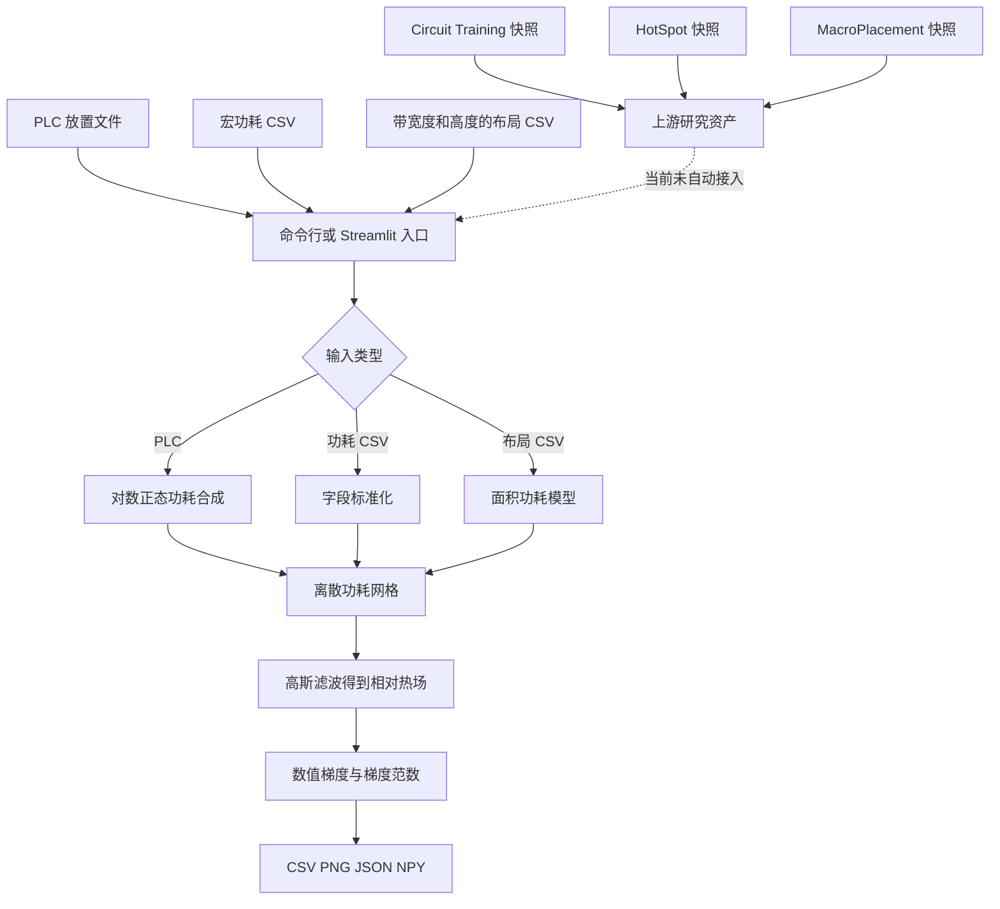
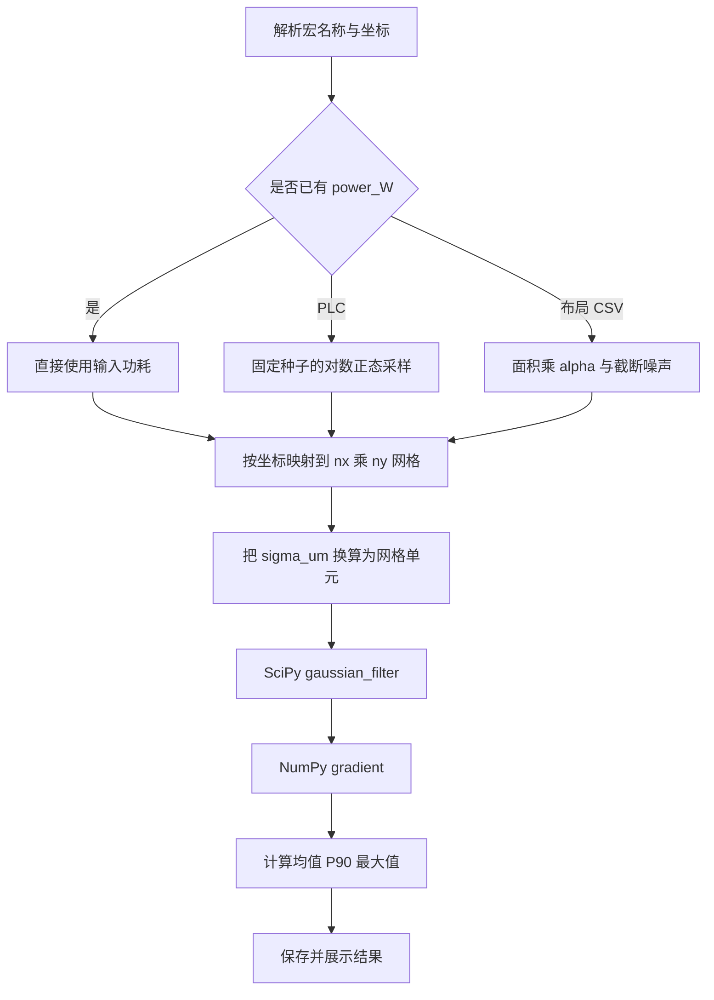

<p align="center">
  
</p>

<p align="center">图 1 从宏单元放置到相对热场与梯度风险的分析链路</p>

<div align="center">
  <h1>X-Aware MacroPlacement</h1>
  <p><strong>面向宏单元布局的功耗合成、近似热场分析与梯度风险可视化原型</strong></p>
  <p>
    <a href="README.en.md">English</a> ·
    <a href="#quickstart-cn">快速开始</a> ·
    <a href="#method-cn">分析方法</a> ·
    <a href="#validation-cn">验证结果</a> ·
    <a href="#limitations-cn">限制与路线</a>
  </p>
</div>

<p align="center">
  
  
  
  
  
  
  
  
</p>

> [!IMPORTANT]
> 当前热场由离散功耗网格经过高斯滤波得到，是用于布局研究的相对指标，不是摄氏温度，也不能替代 HotSpot、有限元分析或签核级热仿真
>
> 仓库内置 Circuit Training、HotSpot 与 MacroPlacement 的上游快照，这些目录保留各自许可证与技术边界，根目录的 Python 原型不会自动调用三个上游工程

> [!WARNING]
> 旧 README 曾把 2025-12-20 写为延期后的预计发布日期，但当前仓库没有版本标签、GitHub Release、持续集成或正式发布证据
>
> 截至 2026-08-24，本仓库应被视为开发中的研究原型，适合复现实验、检查算法和继续开发，不适合直接作为生产级电子设计自动化签核工具

本文所有数值来自提交 `5ae674c6d3d73cf65d86b5d9590ed2ac99f80f00` 的代码审计、仓库记录或 2026-08-24 的隔离验证

<a id="overview-cn"></a>
## 1 项目概览

X-Aware MacroPlacement 探索如何把布局位置、合成功耗、相对热场和热梯度组织为可检查的数据链路
核心实现只有三个 Python 文件，支持命令行批处理和 Streamlit 图形界面
仓库同时保存了 Circuit Training [1]、HotSpot [2] 与 MacroPlacement [3] 的完整上游资料，供强化学习宏布局、物理热仿真和公开基准研究使用

<div align="center">

表 1.1 当前能力

| 维度 | 当前实现 | 证据位置 |
| --- | --- | --- |
| 放置输入 | 读取 Circuit Training 风格的 `.plc` 文本 | `scripts/thermal_cli.py`、`scripts/thermal_gui.py` |
| 功耗输入 | 读取 `name,x_um,y_um,power_W` 或同义宏名称字段 | 两个入口脚本中的 `detect_csv_type` |
| 布局输入 | 读取带宽度和高度的布局 CSV，并按面积合成功耗 | `layout_csv_to_macro_power` |
| 功耗合成 | PLC 使用固定随机种子的对数正态模型，布局 CSV 使用面积模型 | `simulate_power_lognormal`、`layout_csv_to_macro_power` |
| 热场近似 | 把点功耗映射到网格，再通过 SciPy 高斯滤波平滑 [4] | `src/thermal/thermal_model.py` |
| 风险指标 | 计算相对热场和梯度范数的均值、90 分位数与最大值 | `thermal_metrics` |
| 命令行输出 | 生成宏功耗 CSV、热图 PNG、指标 JSON 与可选 NPY | `scripts/thermal_cli.py` |
| 图形界面 | 上传 PLC 或 CSV，调整网格、核宽与功耗模型，在线查看结果 | `scripts/thermal_gui.py` |
| 示例数据 | 保存 1410 条宏记录、4 组 NPY 数组与 3 份指标 JSON | `scripts/legalized.plc`、`data/`、`outputs/` |
| 语言 | 中文主 README，英文 README 作为完整备份 | `README.md`、`README.en.md` |

</div>

这个原型回答的是“布局中的相对热点和陡峭变化可能在哪里”
它目前不会训练强化学习策略、执行合法化、调用 HotSpot、估算真实封装边界或给出签核结论

<a id="positioning-cn"></a>
## 2 适用范围

<div align="center">

表 2.1 使用判断

| 场景 | 适合程度 | 判断依据 |
| --- | --- | --- |
| 检查 PLC 到热图的数据链路 | 适合 | 仓库提供输入、脚本、数组、JSON 与图形输出 |
| 研究网格大小和高斯核宽的影响 | 适合 | 命令行和界面均开放 `nx`、`ny` 与 `sigma_um` |
| 为宏布局奖励函数构建初步特征 | 有条件适合 | 输出可作为相对特征，但必须先校准尺度和数据血缘 |
| 比较两个布局的物理温度 | 暂不适合 | 当前温度场没有热阻、材料、边界条件和绝对单位 |
| 芯片热签核或可靠性签核 | 不适合 | 当前算法不是签核级求解器，也没有验证误差界 |
| 直接训练 Circuit Training 模型 | 不适合 | 根目录原型没有连接内置的 Circuit Training 训练流程 |

</div>

<div align="center">

表 2.2 状态证据

| 状态项 | 当前证据 | 结论 |
| --- | --- | --- |
| 旧预计日期 | 旧 README 写明 2025-12-20，并标注延期 | 日期已经过去，只作为历史记录保留 |
| 版本标签 | 没有 Git 标签 | 尚未形成可引用版本 |
| GitHub Release | 没有 Release | 尚未形成发布包 |
| 依赖清单 | 没有 `requirements.txt`、`pyproject.toml` 或锁文件 | 安装版本需要由使用者管理 |
| 自动化测试 | 没有测试目录与持续集成工作流 | 本轮验证属于独立审计，不等同于仓库自带保障 |
| 项目阶段 | 核心脚本、示例数据和界面可以运行 | 开发中的研究原型 |

</div>

<a id="architecture-cn"></a>
## 3 系统结构

<div align="center">



图 3.1 根目录分析原型与内置上游工程的边界

</div>

`scripts/thermal_cli.py` 和 `scripts/thermal_gui.py` 各自包含一套输入解析与功耗合成辅助函数
它们共同调用 `src/thermal/thermal_model.py`，但辅助逻辑目前没有抽成共享模块，因此两个入口后续可能产生行为漂移

<a id="gallery-cn"></a>
## 4 结果图库

<p align="center">
  
</p>

<p align="center">图 4.1 在本地隔离环境中渲染的 Streamlit 输入界面</p>

界面允许切换 PLC 与 CSV，调整 16 至 512 的网格尺寸、1 至 500 微米的高斯核宽、随机种子以及两类功耗模型参数
上传 PLC 后可以先转换并下载宏功耗 CSV，也可以直接运行热场计算

<p align="center">
  
</p>

<p align="center">图 4.2 当前代码使用默认参数重放 `scripts/legalized.plc` 得到的相对热场</p>

<p align="center">
  
</p>

<p align="center">图 4.3 当前代码使用默认参数重放得到的梯度范数场</p>

图 4.2 和图 4.3 展示的是相对数值
亮区说明当前模型把更多功耗集中在该区域，不能直接解读为真实芯片的摄氏温度或失效位置

<a id="method-cn"></a>
## 5 分析方法

<div align="center">



图 5.1 相对热场与梯度指标的计算流程

</div>

### 5.1 PLC 功耗模型

PLC 解析器把每一条非空、非注释且前 3 列可解析的记录视为一个宏
功耗来自均值归一化后的对数正态采样，默认基准功耗为 `1.0`、对数标准差为 `0.4`、随机种子为 `42`
相同输入与相同参数会生成相同功耗表

### 5.2 布局 CSV 功耗模型

当 CSV 提供 `width_um` 与 `height_um` 时，脚本先计算矩形面积，再乘默认系数 `1e-5 W/µm²`
高斯噪声的默认标准差为 `0.2`，噪声会截断到 `[-0.5, 0.5]`

### 5.3 相对场计算

核心模块把每个宏的点功耗累加到最近网格单元，然后使用 SciPy 的 `gaussian_filter` 扩散 [4]
网格间距来自芯片宽高，梯度由 NumPy 的 `gradient` 计算 [5]
输出字段名沿用 `temperature`，但当前模型没有求解热传导方程，因此更准确的理解是“平滑后的相对功耗场”

<a id="inputs-cn"></a>
## 6 数据契约

<div align="center">

表 6.1 输入格式

| 输入 | 必需列或记录 | 功耗来源 | 芯片尺寸默认值 |
| --- | --- | --- | --- |
| PLC | 每条有效记录至少为 `name x y` | 对数正态合成 | 最大 x、y 坐标分别乘 `1.1` |
| 宏功耗 CSV | `name` 或 `macro_name`、`x_um`、`y_um`、`power_W` | 直接读取 | 最大 x、y 坐标分别乘 `1.1` |
| 布局 CSV | `macro_name`、`x_um`、`y_um`、`width_um`、`height_um` | 面积模型 | 最大 x、y 坐标分别乘 `1.1` |

</div>

<div align="center">

表 6.2 命令行输出

| 目录 | 文件 | 内容 |
| --- | --- | --- |
| `<out-dir>/macro_power/` | `<prefix>_macro_power.csv` | 标准化后的名称、坐标与功耗 |
| `<out-dir>/figures/` | `<prefix>_temperature.png` | 相对热场图 |
| `<out-dir>/figures/` | `<prefix>_grad_norm.png` | 梯度范数图 |
| `<out-dir>/metrics/` | `<prefix>_thermal_stats.json` | 两个场的均值、90 分位数与最大值 |
| `data/thermal/` | `<prefix>_temp.npy`、`<prefix>_grad_norm.npy` | 使用 `--save-npy` 时保存的数组 |

</div>

注：`--save-npy` 当前固定写入仓库根目录的 `data/thermal/`，不会跟随 `--out-dir`

<a id="quickstart-cn"></a>
## 7 快速开始

### 7.1 环境准备

本轮在 Windows、Python 3.12.7 中验证了 NumPy 2.5.2、pandas 3.0.5、SciPy 1.18.1、Matplotlib 3.11.1 与 Streamlit 1.62.0
这些版本是可复现的审计基线，不是仓库已经承诺的兼容范围

- 第一步，创建隔离环境并安装验证过的依赖

```powershell
python -m venv .venv # 创建项目专用的 Python 虚拟环境
.\.venv\Scripts\Activate.ps1 # 激活当前 PowerShell 会话中的虚拟环境
python -m pip install numpy==2.5.2 pandas==3.0.5 scipy==1.18.1 matplotlib==3.11.1 streamlit==1.62.0 # 安装 2026-08-24 已验证的依赖组合
```

- 第二步，在 Windows 中文控制台中启用 Python UTF-8 模式，再重放仓库示例

```powershell
$env:PYTHONUTF8 = "1" # 避免默认控制台编码无法输出微米符号
python scripts\thermal_cli.py --plc-file scripts\legalized.plc --out-dir outputs\replay --prefix legalized # 采用 128 × 128 默认网格，核宽为 80 微米
```

- 第三步，检查 `outputs/replay/` 中的功耗表、热图与指标 JSON

在 Linux 或 macOS 中，可以使用以下等价流程

```bash
python3 -m venv .venv # 创建项目专用的 Python 虚拟环境
source .venv/bin/activate # 激活当前 shell 中的虚拟环境
python -m pip install numpy==2.5.2 pandas==3.0.5 scipy==1.18.1 matplotlib==3.11.1 streamlit==1.62.0 # 安装 2026-08-24 已验证的依赖组合
python scripts/thermal_cli.py --plc-file scripts/legalized.plc --out-dir outputs/replay --prefix legalized # 使用默认参数重放仓库示例
```

### 7.2 启动图形界面

```powershell
$env:PYTHONUTF8 = "1" # 在 Windows 中文控制台中启用 Python UTF-8 模式
python -m streamlit run scripts\thermal_gui.py --server.address 127.0.0.1 # 启动仅绑定本机的 Streamlit 界面
```

图形界面由 Streamlit 提供 [6]
如需在远程机器运行，应自行配置访问控制、传输加密和防火墙，不要把开发服务器直接暴露到公共网络

<a id="cli-cn"></a>
## 8 命令行参数

<div align="center">

表 8.1 主要参数

| 参数 | 默认值 | 说明 |
| --- | --- | --- |
| `--plc-file` | 与 `--macro-csv` 二选一 | PLC 放置文件 |
| `--macro-csv` | 与 `--plc-file` 二选一 | 宏功耗或布局 CSV |
| `--out-dir` | `outputs` | CSV、PNG 与 JSON 的输出根目录 |
| `--prefix` | 输入文件名 | 输出文件前缀 |
| `--chip-width-um` | 最大 x 乘 `1.1` | 手动覆盖芯片宽度 |
| `--chip-height-um` | 最大 y 乘 `1.1` | 手动覆盖芯片高度 |
| `--nx`、`--ny` | `128` | 网格列数与行数 |
| `--sigma-um` | `80.0` | 高斯核的物理尺度 |
| `--save-npy` | 关闭 | 保存 NumPy 数组 |
| `--base-power` | `1.0` | PLC 合成功耗均值 |
| `--log-sigma` | `0.4` | PLC 对数正态分布宽度 |
| `--seed` | `42` | 两类合成功耗使用的随机种子 |
| `--alpha-w-per-um2` | `1e-5` | 布局面积到功耗的比例 |
| `--noise-std` | `0.2` | 布局面积功耗的噪声标准差 |

</div>

<a id="validation-cn"></a>
## 9 验证记录

`scripts/legalized.plc` 的注释元数据描述了 Ariane、NanGate45 和宏布局成本信息
当前轻量解析器不会按 PLC 元数据区分硬宏、引脚或其他节点，而是读出 1410 条坐标记录

<div align="center">

表 9.1 默认参数重放结果

| 指标 | 相对热场 | 梯度范数 |
| --- | ---: | ---: |
| 均值 | 0.1499493718 | 0.0016559281 |
| 90 分位数 | 0.2410360724 | 0.0013460991 |
| 最大值 | 3.5641796589 | 0.0324288234 |

</div>

<div align="center">

表 9.2 本轮验证记录

| 检查 | 环境或输入 | 结果 |
| --- | --- | --- |
| Python 语法 | 3 个第一方 Python 文件 | 通过 |
| 核心烟雾测试 | 2 个合成宏、32 × 32 网格 | 形状正确、数值有限、结果确定性一致 |
| PLC 重放 | `scripts/legalized.plc`、默认参数 | 1410 条记录，功耗 CSV 与已提交 CSV 完全一致 |
| 指标重放 | 当前代码与 `legalized_thermal_stats.json` | 均值和最大值一致，P90 只有浮点分位算法级微小差异 |
| 命令行图形 | 相对热场与梯度范数 PNG | 生成并完成视觉检查 |
| Streamlit | Chromium 本地隔离实例 | 页面标题、输入选择、参数控件与上传控件正常渲染 |
| Windows 默认编码 | 未设置 `PYTHONUTF8` | 微米符号触发 `UnicodeEncodeError` |
| 仓库自带测试与持续集成 | 全仓库扫描 | 未提供 |

</div>

### 9.1 已提交输出的数据血缘差异

当前 PLC 重放得到的宏功耗 CSV 与 `outputs/macro_power/legalized_macro_power.csv` 完全一致
用这份 CSV 再运行当前代码时，相对热场最大值仍为 `3.5641796589`
但已提交的 `legalized_macro_power_temp.npy` 和对应 JSON 的最大值为 `171.9764862061`，约为当前重放值的 48.25 倍

仓库没有保存生成这组较大数值所需的不同参数、不同输入或执行日志
因此这组历史输出可以作为待追溯资产保留，但不应与当前默认重放结果直接比较，也不应被解释为已经复现

<a id="structure-cn"></a>
## 10 仓库结构

<div align="center">

表 10.1 目录职责

| 路径 | 内容 | 维护边界 |
| --- | --- | --- |
| `src/thermal/thermal_model.py` | 功耗网格、相对热场、梯度与指标 | 根目录原型核心 |
| `scripts/thermal_cli.py` | 命令行解析、功耗合成、结果保存 | 根目录原型入口 |
| `scripts/thermal_gui.py` | Streamlit 上传、参数与结果展示 | 根目录原型入口 |
| `scripts/legalized.plc` | 示例放置及其公开设计元数据 | 审计时已移除一条本机绝对路径 |
| `data/thermal/` | 已提交的相对热场和梯度 NPY | 部分数据血缘待补充 |
| `outputs/macro_power/` | 已提交的标准化宏功耗 CSV | 当前默认 PLC 重放可复现 |
| `outputs/metrics/` | 已提交的指标 JSON | 两类结果的可复现程度不同 |
| `docs/assets/readme/` | 本轮生成的横幅、界面截图与重放热图 | README 本地视觉资产 |
| `external/circuit_training/` | Google Circuit Training 快照 | 上游 Apache 2.0 项目 |
| `external/HotSpot/` | HotSpot 热仿真器快照 | 上游自有开源许可证 |
| `external/MacroPlacement/` | TILOS MacroPlacement 快照与基准 | 上游 BSD 3-Clause 项目及嵌套许可证 |

</div>

仓库共有 3824 个跟踪文件，其中 3808 个位于 `external/`
这意味着克隆体积、第三方许可证、二进制产物和上游更新策略都是项目治理的一部分

<a id="upstream-cn"></a>
## 11 第三方边界

<div align="center">

表 11.1 内置上游工程

| 工程 | 用途 | 根许可证 | 当前集成状态 |
| --- | --- | --- | --- |
| Circuit Training [1] | 分布式深度强化学习芯片布局框架 | Apache 2.0 | 保存完整快照，根目录原型未调用 |
| HotSpot [2] | 早期设计阶段的 2D、3D 与微流体冷却热仿真 | 上游 `LICENSE` | 保存完整快照，根目录原型未调用 |
| MacroPlacement [3] | 宏布局基准、流程、转换器与公开复现实验 | BSD 3-Clause | 保存完整快照，根目录原型未调用 |

</div>

根目录代码按 Apache License 2.0 发布 [7]
`external/` 内的文件继续受各自许可证约束，MacroPlacement 的测试用例还包含更多嵌套许可证
分发、修改或打包整个仓库前，应逐层核对这些许可证，而不是只查看根目录 `LICENSE`

<a id="security-cn"></a>
## 12 安全部署边界

本轮扫描没有发现第一方代码中的账号、密码、令牌或许可证密钥
示例 PLC 注释中原有一条可识别的本机服务器绝对路径，现已替换为脱敏来源标记，同时保留文件来源这一信息
HotSpot 上游 Makefile 的两个注释示例原本带有历史用户目录和易被识别为私有网络地址的版本路径，现已替换为通用 MKL 安装占位符

仓库不提供在线服务地址，也不要求用户提交凭据
Streamlit 上传内容会由运行该进程的环境处理，使用者应在受控本机或受保护的内部网络运行
公开部署前至少需要增加身份认证、HTTPS、上传大小策略、资源隔离、日志脱敏和依赖漏洞审计

外部工程中可能保存论文作者、维护者邮箱、公开基准路径和上游历史记录
这些属于第三方公开来源与许可证归属信息，不能在没有许可证审查的情况下批量删除或冒充第一方内容

<a id="limitations-cn"></a>
## 13 迭代路线

<div align="center">

表 13.1 已知限制

| 限制 | 当前影响 | 建议方向 |
| --- | --- | --- |
| 相对热场没有物理温度单位 | 无法用于热签核或跨平台绝对比较 | 接入 HotSpot 或经校准的热阻模型 |
| PLC 解析器只看前 3 列 | 1410 条记录不等同于注释中的 133 个硬宏 | 使用节点类型与 PLC 元数据过滤 |
| 已提交输出缺少完整参数血缘 | 一组历史数组无法由当前默认输入重现 | 为每次运行保存输入哈希、参数和代码提交号 |
| 两个入口复制辅助函数 | CLI 与 GUI 可能逐渐产生不同结果 | 抽取共享输入与功耗模块 |
| 缺少依赖清单 | 全局环境容易出现 NumPy 与 pandas 不兼容 | 增加 `pyproject.toml` 和锁文件 |
| Windows 默认编码会中止 CLI | 未设置 UTF-8 时无法完成运行 | 使用 ASCII 单位文本或显式配置 stdout |
| `--save-npy` 忽略 `--out-dir` | 运行可能覆盖仓库数据目录 | 把 NPY 目录纳入输出根目录 |
| 没有异常输入边界测试 | 空值、负功耗、越界坐标等行为缺乏保障 | 增加单元、属性和端到端测试 |
| 没有持续集成 | 兼容性回归无法自动发现 | 在受支持的 Python 版本上运行测试与渲染检查 |
| 三个上游快照体量大 | 克隆、审计与更新成本高 | 记录上游提交并评估子模块或发布资产方案 |

</div>

建议按照以下顺序推进

- 第一步，固定依赖与支持的 Python 版本，并把当前核心烟雾测试转成仓库测试

- 第二步，记录每份输出的输入哈希、全部参数、依赖版本和代码提交号，重新生成无法追溯的历史数组

- 第三步，统一 CLI 与 GUI 的解析和功耗逻辑，修复 Windows 编码与 NPY 输出目录

- 第四步，把近似场与 HotSpot 结果对齐，给出误差、单位和适用条件

- 第五步，再把经过校准的热指标接入 Circuit Training 或 MacroPlacement 的奖励、约束与评估流程

<a id="contributing-cn"></a>
## 14 贡献指南

提交算法或数据变更时，请同时提供最小输入、完整参数、随机种子、依赖版本、代码提交号、输出摘要和误差判断
新增图像应优先使用仓库本地资产，避免依赖可能失效或泄露环境信息的外链截图
任何示例都不得包含真实服务器地址、用户目录、账号、令牌、许可证密钥或未授权的专有设计数据

建议在合并前完成语法检查、核心单元测试、PLC 与两类 CSV 的端到端测试、CLI 输出检查、Streamlit 页面渲染和隐私扫描

<a id="license-cn"></a>
## 15 许可证

根目录项目使用 Apache License 2.0，完整条款见 [`LICENSE`](LICENSE)
第三方目录使用各自许可证，使用者需要分别遵守 `external/circuit_training/LICENSE`、`external/HotSpot/LICENSE`、`external/MacroPlacement/LICENSE` 及更深层的许可证文件

<a id="references-cn"></a>
## 16 参考资料

[1] Google Research, “Circuit Training: An open-source framework for generating chip floor plans with distributed deep reinforcement learning,” GitHub. [Online]. Available: https://github.com/google-research/circuit_training

[2] University of Virginia, “HotSpot: A pre-RTL processor thermal simulator,” GitHub. [Online]. Available: https://github.com/uvahotspot/HotSpot

[3] TILOS AI Institute, “MacroPlacement,” GitHub. [Online]. Available: https://github.com/TILOS-AI-Institute/MacroPlacement

[4] SciPy Community, “scipy.ndimage.gaussian_filter,” SciPy documentation. [Online]. Available: https://docs.scipy.org/doc/scipy/reference/generated/scipy.ndimage.gaussian_filter.html

[5] NumPy Developers, “numpy.gradient,” NumPy documentation. [Online]. Available: https://numpy.org/doc/stable/reference/generated/numpy.gradient.html

[6] Snowflake Inc., “Streamlit documentation.” [Online]. Available: https://docs.streamlit.io/

[7] Apache Software Foundation, “Apache License, Version 2.0,” Jan. 2004. [Online]. Available: https://www.apache.org/licenses/LICENSE-2.0
